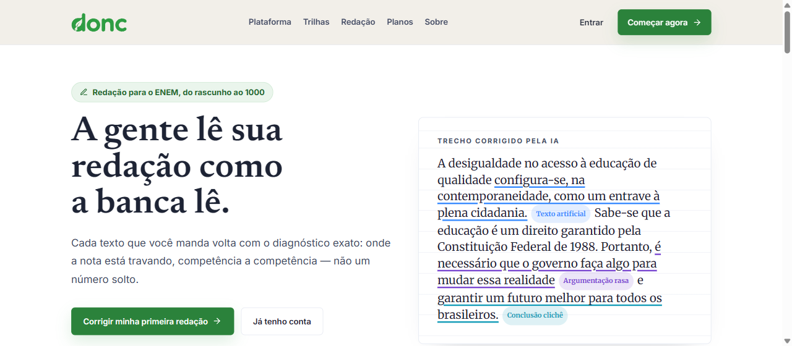
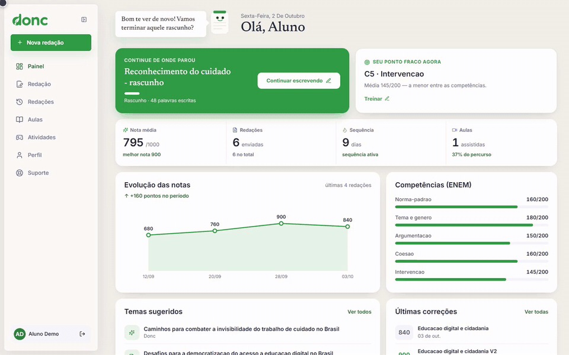

# Donc

> AI-assisted Portuguese and essay-writing prep for Brazil's ENEM exam — an essay correction pipeline built from specialized LLM agents, plus a gamified cognitive trainer.

**Live app:** https://app-redacao-five.vercel.app · **Docs in Portuguese:** [docs/README.pt-BR.md](docs/README.pt-BR.md)


[](https://github.com/LorenzoMarty/Donc/actions/workflows/quality.yml)





<sub>Walkthrough of the running app with demo seed data (sped up 1.6x). [Full-quality video](docs/demo.mp4).</sub>

## What it does

ENEM essays are graded on five competencies, and students rarely get detailed feedback. Donc gives it to them:

- **Essay correction with AI agents.** A pipeline of specialized agents (built with the [`agno`](https://github.com/agno-agi/agno) framework and OpenAI) analyzes theme fit, thesis, argumentation, cultural repertoire and grammar, scores each competency, runs an elimination gate, and audits the final score.
- **Cognitive writing trainer.** Seven "symptom hubs" route the student to the exercises that address their actual weaknesses, with game-like engines, XP, streaks and qualitative S/A/B/C feedback.
- **Study planning and analytics.** Dashboards, rewrite evaluation and personalized study plans.
- **Admin area.** Content, exercises, subscriptions and support management.

## Architecture

```text
Next.js 16 (App Router)  ──►  FastAPI  ──►  PostgreSQL 16 + pgvector
        │                        │
        │                        ├──►  Celery workers  ◄──►  Redis
        │                        └──►  agno agents  ──►  OpenAI
        └── Zustand, Tailwind          └── Langfuse / OpenLIT tracing + cost telemetry (BRL)
```

| Layer | Technology |
|---|---|
| Frontend | Next.js 16, TypeScript, Tailwind CSS, Zustand, Vitest, Playwright |
| Backend | FastAPI, SQLAlchemy, Pydantic, Alembic, Celery |
| Data | PostgreSQL (`pgvector`), Redis |
| AI | `agno` agents, OpenAI, Langfuse (optional tracing) |
| Quality | ESLint + `tsc` + Vitest (frontend), pytest + coverage (backend), GitHub Actions quality gate on pull requests |

Backend layout: `routes/` (REST per domain) → `services/` (business rules) → `repositories/` (data access), with `agents/`, `vectorstore/` (RAG), `queues/` (Celery jobs), `schemas/` (Pydantic DTOs) and `alembic/` (migrations).

## Getting started

Requirements: Node.js 22, Python 3.12+, Docker and Docker Compose for the full stack.

```bash
cp .env.example .env
docker compose up --build
```

This starts four services: `db` (Postgres 16 + pgvector), `backend` (FastAPI), `worker` (Celery) and `frontend` (Next.js).

| Service | URL |
|---|---|
| Frontend | http://localhost:3000 |
| Backend | http://localhost:8000 |
| Swagger / OpenAPI | http://localhost:8000/docs |

Without Docker:

```bash
npm --prefix frontend install
npm run dev:frontend

cd backend
python -m venv .venv && source .venv/bin/activate   # Windows: .\.venv\Scripts\activate
pip install -r requirements.txt
DATABASE_URL=sqlite:///./local_dev.db python -m uvicorn src.main:app --reload --port 8000
```

## Quality checks

```bash
npm --prefix frontend run quality   # eslint + typegen/tsc + vitest
cd backend && .\quality.ps1         # prospector + pytest --cov
```

The same checks run in [GitHub Actions](.github/workflows/quality.yml) on every pull request to `main`.

## API contract

Every endpoint returns the same envelope, and the frontend HTTP client (`frontend/src/lib/http-client.ts`) unwraps it centrally.

```json
{ "success": true,  "message": "", "data": {} }
{ "success": false, "message": "Human-readable message", "error": "error_code" }
```

## Configuration

Copy `.env.example` (Docker/local) or the per-service examples in `backend/.env.example` and `frontend/.env.example` (Vercel). In production set at least `DATABASE_URL` (managed Postgres), `JWT_SECRET_KEY`, `FRONTEND_ORIGIN`, `INTERNAL_API_URL` and, for real AI responses, `OPENAI_API_KEY`. Keep `ENABLE_PGVECTOR=false` if your database does not have the `vector` extension yet.

## Deployment

Frontend and backend are deployed as separate Vercel projects. See [docs/README.pt-BR.md](docs/README.pt-BR.md) for the full deployment notes.

## License

[MIT](LICENSE)
